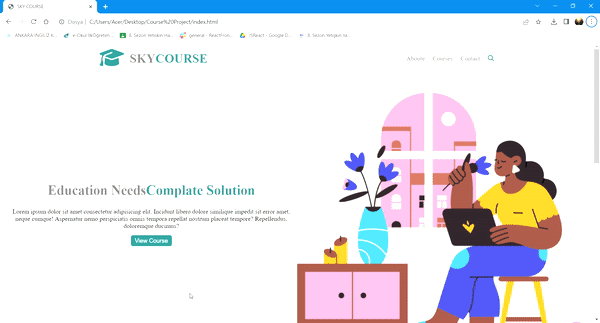

<h1> KURS SİTESİ/COURSE SITE </h1>
Projemde bir kursa ait web sitesi tasarımı yaptım. Sitede "hakkımızda", "iletişim" ve "kurslar" bölümlerine yer verdim. bu bölümlerin her birinin kontrolünü sağladım. İletişim bölümüne e-mail butonu ekledim. Projemi iconlar ve görseller ile zenginleştirdim.   
In my project, I designed a website for a course. I included "about us", "contact" and "courses" sections on the site. I have checked each of these sections. I added an e-mail button to the contact section. I enriched my project with icons and images.
<h1> Kullandığım Teknolojiler / Technologies I use </h1>
Projemde HTML5 ve CSS3 kodları kullandım.   
I used HTML5 and CSS3 codes in my project.
<h2>Ekran Görüntüsü/Screenshot </h1>

